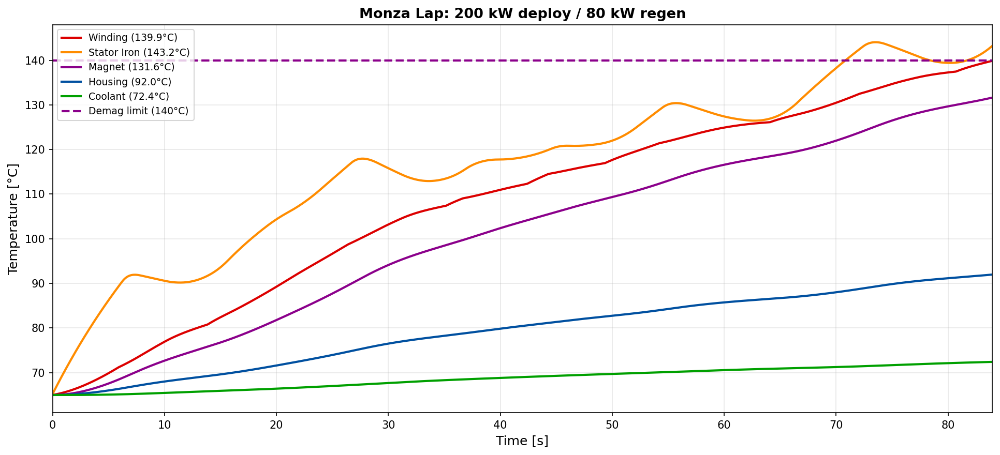
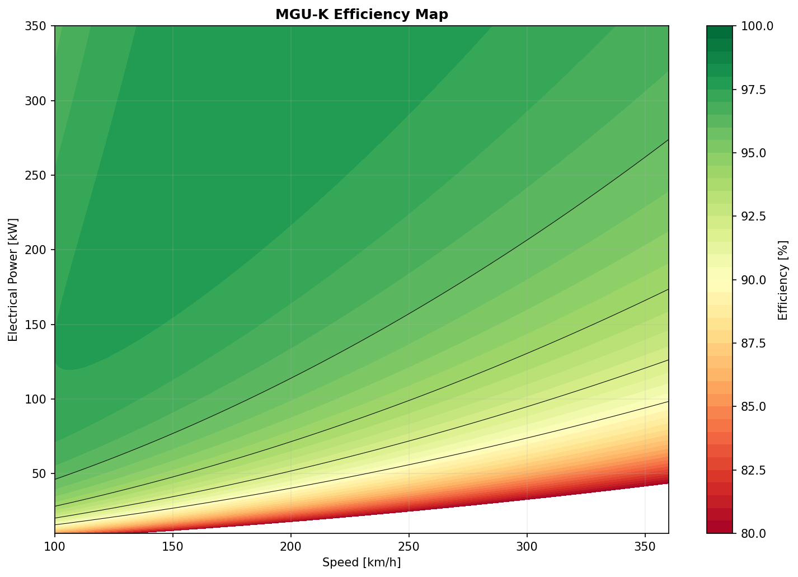
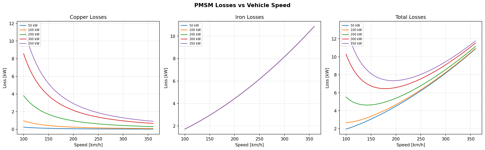
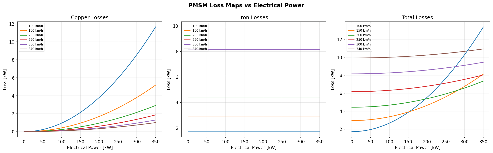
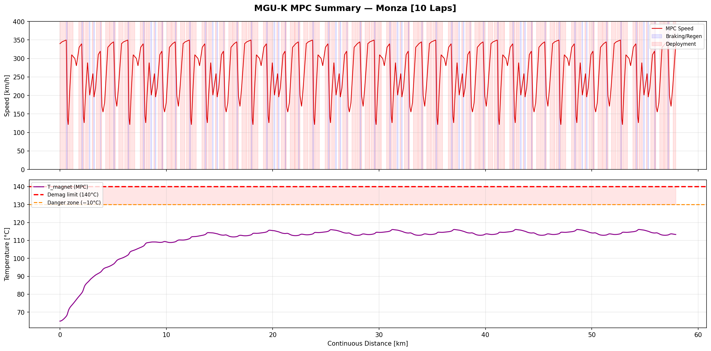
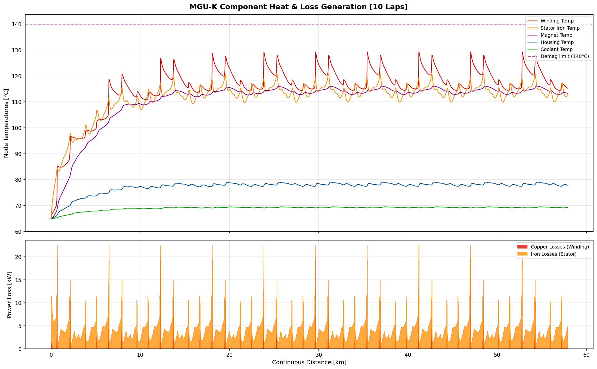
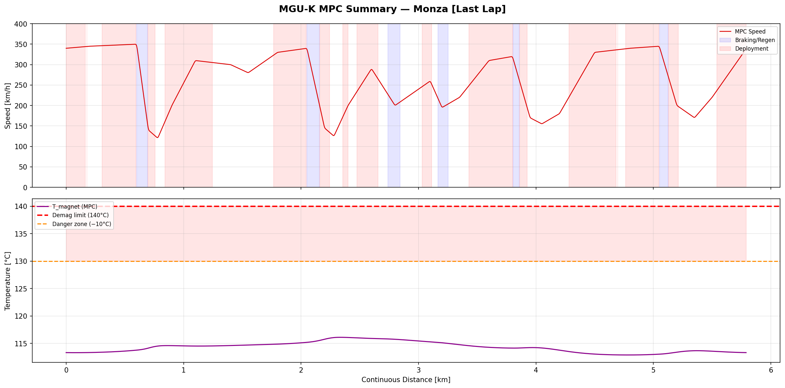
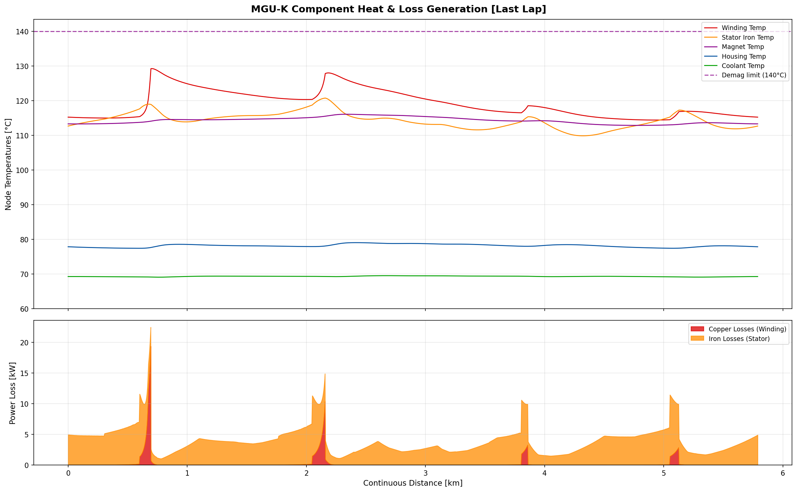

<div align="center">

# MGU-K Thermal-Constrained ERS Deployment Optimiser

### Ferrari F1 Engineering Academy 2026 — Wolfgang Guio


**A coupled thermal-electrical Model Predictive Controller that optimises MGU-K deployment strategy over a full Monza race stint — while preventing permanent magnet demagnetisation in real time.**

</div>

---

## The Central Insight

> *Deployment strategy and thermal management are not two problems. They are one.*

Under the 2026 F1 regulations — which eliminate the MGU-H and **triple MGU-K peak power to 350 kW** — the electrical system becomes half the powertrain. At that power density, aggressive deployment on Monza's long straights generates enough heat to permanently demagnetise the rotor magnets above **140 °C**. Permanent magnet demagnetisation is irreversible. There is no recovering mid-race.

A naive fixed-strategy controller (200 kW deploy / 80 kW regen) reaches **131.6 °C** — leaving only **8.4 °C** from catastrophic failure — within a single lap. The MPC presented here solves this by treating the thermal state as a first-class constraint, not an afterthought.

---

## Key Results — 10-Lap Thermal Soak

| Metric | Fixed Strategy | **MPC Controller** |
|--------|---------------|-------------------|
| T_magnet peak (multi-lap) | 131.6 °C ⚠️ | **116.1 °C ✅** |
| Margin vs. 140 °C limit | 8.4 °C | **23.9 °C** |
| Thermal equilibrium | Not reached | **Lap 6** (stable) |
| Solver convergence | — | **100 %** (1,680/1,680 solves) |
| Mean solve time | — | **12 ms/step** |
| Energy balance | Uncontrolled | **1.71 MJ deployed = 1.71 MJ regen** |
| SOC at steady state | — | **63.4 %** (energy-neutral lap to lap) |

The MPC reaches a **periodic thermal equilibrium**, cycling the magnet temperature safely between 113 °C and 116 °C across laps 6–10. The fixed strategy has no such equilibrium — it continues rising.

---

## Engineering Motivation: The 2026 Regulatory Shift

The 2026 FIA Technical Regulations fundamentally change the powertrain challenge:

- **MGU-H eliminated** — no exhaust energy recovery, removing the turbocharger electrical coupling that regulated internal temperatures
- **MGU-K peak power: 120 kW → 350 kW** — the electric motor is now a co-equal primary propulsion device
- **Energy cap: 4 MJ/lap** — aggressive deployment must be rationed strategically
- **Vehicle mass: 800 kg** — greater drag penalty makes every watt count

At Monza, 350 kW MGU-K output is roughly equal to the ICE contribution at full throttle. The electric motor is no longer support — it is **50 % of the drivetrain**. This shifts the critical engineering challenge from turbo management to **electrical/thermal deployment optimisation**.

Without the MGU-H's continuous heat regulation role, the responsibility for thermal safety falls entirely on the MGU-K control strategy.

---

## Why MPC Is Required

The fixed strategy below illustrates the failure mode. Stator iron reaches **143.6 °C** and magnets **131.6 °C** on a simple constant-power open-loop strategy:


*Fixed-strategy (no MPC): Stator iron exceeds 140 °C, magnets reach 131.6 °C — 8.4 °C from irreversible demagnetisation. Red dashed line = demagnetisation limit.*

A reactive thermal deration system would throttle power *after* the temperature spike. An MPC sees **2 seconds into the future**, anticipates thermal run-up, and pre-emptively reduces deployment in the final phase of a straight — sacrificing a small fraction of speed to preserve the constraint margin across the entire stint.

---

## System Architecture

```
  FastF1 Telemetry (Monza 2025 Race Lap)
           │
           ▼
  ┌─────────────────┐    state x = [v, SOC, T_winding, T_magnet,
  │   track_model   │              T_stator, T_housing, T_coolant]
  │  (segment data) │ ──────────────────────────────────────────►┐
  └─────────────────┘                                            │
                                                                 ▼
  ┌─────────────────┐    P_e (W)              ┌──────────────────────────┐
  │  pmsm_losses    │ ◄──────────────────────  │    mpc_controller        │
  │  (Cu + Fe loss) │                          │  OSQP · RTI Jacobians    │
  └───────┬─────────┘                          │  N=60 steps · Δt=0.05 s  │
          │ P_loss (W)                          └──────────────────────────┘
          ▼                                              ▲
  ┌─────────────────┐   T_magnet < 140 °C              │
  │ thermal_network │ ─────────────────────────────────┘
  │  (5-node ODE)   │   (hard constraint, closed loop)
  └─────────────────┘
```

**Two-way coupling at every 0.05 s timestep:**
1. MPC solves for optimal `P_e` given current state
2. Loss model computes `P_copper` and `P_iron` from `P_e` and speed `v`
3. Thermal ODE updates all 5 node temperatures
4. Updated temperatures become **hard constraints** for the next MPC window

This is Option B full feedback — physically consistent and impossible to optimise independently.

---

## Physics

### PMSM Loss Model (`src/pmsm_losses.py`)

Two fundamentally different loss mechanisms, each dominant in a different operating regime:

| Loss Type | Physics | Formula | Dominant Regime |
|-----------|---------|---------|-----------------|
| **Copper (ohmic)** | Current through winding resistance | P_cu = ½ · R_s · I_s² | High torque / low speed |
| **Iron (Steinmetz)** | Eddy currents + hysteresis in stator core | P_fe = k_h·f·B^α + k_e·(f·B)² | High speed / all loads |

**This duality is the core engineering insight.** At Monza's 330 km/h top speed, iron losses are high regardless of power output. At low-speed deployment (acceleration zones), copper losses dominate. The two regimes require fundamentally different thermal management strategies — which is precisely why a map-aware, predictive controller is necessary.


*MGU-K efficiency map across the 10-lap thermal soak. Peak efficiency >98 % at high speed / moderate power — the MPC targets this operating corridor.*


*Left: copper losses (power-dependent). Centre: iron losses (speed-dependent — curves coincide across power levels, confirming independence). Right: total losses.*


*Iron loss curves are flat horizontal lines — purely speed-driven, invariant to deployment level. This decoupling is what allows the thermal model to be linearised cleanly.*

### 5-Node Lumped Thermal Network (`src/thermal_network.py`)

```
P_copper ──► [Windings]
                │ R = 0.02 K/W
                ▼
P_iron ──────► [Stator Iron]
                │ R = 0.05 K/W    R = 0.01 K/W
                ├─────────────► [Rotor/Magnets] ← Critical: T < 140 °C
                │
                ▼
              [Housing]
                │ R = 0.005 K/W
                ▼
              [Coolant] ← T_inlet = 65 °C (fixed)
```

Governing equation per node:

```
C_i · dT_i/dt = P_loss,i + Σ_j (T_j − T_i) / R_ij
```

| Node | C (J/K) | Key Resistance (K/W) |
|------|---------|---------------------|
| Windings | 800 | R_winding→stator = 0.02 |
| Stator Iron | 2 000 | R_stator→magnet = 0.05 |
| Rotor / Magnets | 400 | — |
| Housing | 5 000 | R_housing→coolant = 0.005 |
| Coolant | 3 000 | T_inlet = 65 °C |

The magnet node (C = 400 J/K) has the **lowest thermal capacitance** in the network — it heats fastest under transient loading and has no direct loss input, receiving heat only by conduction from the stator iron. This makes its temperature trajectory inherently predictive: stator iron temperature 2–5 seconds ago determines magnet temperature now. MPC's look-ahead window directly addresses this lag.

### MPC Formulation (`src/mpc_controller.py`)

**Objective:**

```
min  Σ_k [ −w_v · (v_ref,k / V_max) · (u_k / P_peak)   ← speed reward on straights
           + w_u · P_e,k²                                ← penalise aggressive switching
           + w_soc · (SOC_k − SOC_ref)² ]                ← track energy reserve at 50%
```

**Constraints (hard-enforced at every step):**

| Constraint | Bound | Rationale |
|-----------|-------|-----------|
| SOC | [20 %, 80 %] | Battery protection |
| T_magnet | < 140 °C | NdFeB demagnetisation — **irreversible** |
| Peak power | ±350 kW | 2026 FIA regulation |
| Total lap energy | ≤ 4 MJ | 2026 FIA regulation |

**Solver:** OSQP with warm-starting (previous solution shifted forward). Numerical Jacobians (finite differences, ε = 10⁻⁶) recomputed at every step — the **Real-Time Iteration (RTI)** approach used in production automotive MPC. Prediction horizon: N = 60 steps (3 s) standard, extended to N = 120 (6 s) in braking zones for anticipatory thermal management.

---

## Results

### 10-Lap Thermal Soak

The simulation carries thermal state and SOC continuously between laps — replicating the real thermal soak behaviour of a race stint from cold start to steady state:

| Lap | T_mag peak (°C) | Margin to 140 °C | SOC start | SOC end |
|-----|----------------|-----------------|-----------|---------|
| 1 | 100.0 | 40.0 °C | 80.0 % | 63.4 % |
| 2 | 110.3 | 29.7 °C | 63.4 % | 63.4 % |
| 3 | 114.3 | 25.7 °C | 63.4 % | 63.4 % |
| 4 | 115.7 | 24.3 °C | 63.4 % | 63.4 % |
| 5 | 116.0 | 24.0 °C | 63.4 % | 63.4 % |
| **6–10** | **116.1** | **23.9 °C** | **63.4 %** | **63.4 %** |

Thermal equilibrium is reached at lap 6. SOC stabilises at 63.4 % from lap 2 — the MPC finds an **energy-neutral periodic orbit** within a single lap and maintains it indefinitely.


*MPC deployment and regen profile (top) overlaid on the Monza speed trace. T_magnet trajectory across all 10 laps (bottom) — converging to 116.1 °C with 23.9 °C safety margin.*


*All 5 thermal nodes (top) and stacked copper/iron loss contributions (bottom) across the full 10-lap soak. The periodic structure mirrors Monza's alternating straights and chicanes.*

### Last-Lap Detail (Thermal Equilibrium State)

Lap 10 represents the sustained thermal steady state:

| Metric | Value |
|--------|-------|
| T_magnet peak | **116.1 °C** (23.9 °C margin) |
| Mean vehicle speed | 248.3 km/h |
| Peak deployment | 173.6 kW (thermal-limited; 350 kW available) |
| Peak regen | 350 kW (full capability used in braking zones) |
| Energy balance | **1.71 MJ deployed = 1.71 MJ recovered** |


*Lap 10 deployment profile and T_magnet trajectory. The asymmetry between peak deployment (173.6 kW) and peak regen (350 kW) reflects the thermal barrier actively reducing forward power on straights.*


*Lap 10 node temperatures and loss breakdown. The recurring thermal pattern matches Monza's 6-segment layout: Rettifilo, Curva Grande, Lesmo, Ascari, Parabolica, back straight.*

---

## Why These Design Choices

**Why OSQP and not a nonlinear solver?**
OSQP is a professional convex QP solver deployed in real automotive MPC systems. It provides hard constraint enforcement, warm-starting from the previous solution (critical for 12 ms solve times at 20 Hz), and certified convergence on each QP sub-problem. The RTI linearisation converts the nonlinear problem into a sequence of convex QPs — a proven approach for real-time embedded MPC. A nonlinear interior-point solver would give slightly better global accuracy but is computationally intractable at 0.05 s steps.

**Why does the magnet node matter more than the windings?**
NdFeB permanent magnets have a lower Curie temperature than surrounding steel. Winding insulation degradation is gradual and partially recoverable with cool-down. **Magnet demagnetisation above 140 °C is instantaneous and irreversible** — the motor permanently loses torque production mid-race. This asymmetry justifies a hard constraint on T_magnet specifically, not a soft penalty.

**Why a 2-second prediction horizon?**
At 330 km/h, a 2-second horizon covers ~180 m — approximately the thermal lag between stator iron heating and magnet temperature response (driven by R_stator→magnet = 0.05 K/W). This allows the MPC to anticipate magnet temperature rise before it appears at the constraint boundary. Longer horizons (tested up to 6 s in braking zones) improve foresight at higher compute cost; 2–3 s was found to be the minimum effective lookahead for this thermal network.

---

## Repository Structure

```
mguk-thermal-mpc/
├── src/
│   ├── track_model.py        # FastF1 Monza 2025 lap extraction; synthetic fallback
│   ├── pmsm_losses.py        # Copper (I²R) + iron (Steinmetz) loss models; saturation
│   ├── thermal_network.py    # 5-node lumped ODE; Euler integration at Δt = 0.05 s
│   ├── mpc_controller.py     # OSQP QP; RTI numerical Jacobians; warm-start shifting
│   └── __init__.py
├── params/
│   └── motor_params.yaml     # All assumed parameters with literature sources
├── plots/                    # 13 output figures (efficiency maps, dashboards, loss maps)
├── data/cache/               # FastF1 telemetry cache
├── main.py                   # 10-lap thermal soak simulation + fixed-strategy comparison
├── requirements.txt
└── setup_env.bat             # Windows venv setup
```

---

## Installation & Usage

```bash
# Clone
git clone https://github.com/wguio07/mguk-thermal-mpc.git
cd mguk-thermal-mpc

# Windows — automated environment setup
setup_env.bat

# Or manually (any platform)
pip install -r requirements.txt

# Run the full 10-lap Monza simulation
python main.py
```

Outputs saved to `plots/`:
- 10-lap thermal soak dashboard (all nodes + losses)
- MPC deployment profile vs track position
- T_magnet trajectory vs 140 °C demagnetisation limit
- PMSM efficiency map and loss breakdown
- Fixed-strategy comparison (baseline failure mode)

**Dependencies:** `fastf1` · `numpy` · `scipy` · `osqp` · `matplotlib` · `pyyaml`

**Track data:** FastF1 Monza 2025 Race. If the API is unavailable, a synthetic 84 s / 5 793 m Monza profile (v_max = 350 km/h) is used as fallback.

---

## Key Assumptions & Limitations

Motor parameters are documented engineering estimates from published literature for 300–400 kW class automotive PMSMs — not fitted to Ferrari proprietary hardware. All assumptions are explicitly sourced in `params/motor_params.yaml`.

| Assumption | Impact if wrong | Sensitivity |
|-----------|----------------|-------------|
| R_s = 2 mΩ/phase | T_winding changes proportionally | ±10 % → ±2–3 °C T_magnet |
| Steinmetz k_h, k_e from M330-35A silicon steel | Iron losses scale linearly | ±20 % → ±1–2 °C |
| Coolant inlet fixed at 65 °C | No coolant transient response | Conservative; real system is adaptive |
| 5-node lumped model | No spatial gradients within nodes | Captures macroscopic dynamics correctly |
| Point-mass vehicle dynamics | No tyre slip, suspension load | Acceptable for energy management level |

---

## Regulatory Context

Designed against the [2026 FIA F1 Power Unit Technical Regulations](https://www.fia.com/regulation/category/110):

- MGU-H: **eliminated**
- MGU-K peak power: **350 kW** (tripled from ~120 kW)
- Maximum deployable energy: **4 MJ/lap**
- NdFeB demagnetisation hard limit: **140 °C**

---

<div align="center">

## Interview Narrative

*"I built a coupled thermal-electrical MPC that optimises MGU-K deployment over a real Monza race lap while simultaneously managing motor component temperatures. The controller uses OSQP with numerical Jacobians recomputed at each 0.05-second step — a Real-Time Iteration approach — and enforces a hard demagnetisation constraint on the permanent magnets.*

*The central insight is that deployment strategy and thermal management are the same problem: you cannot optimise one without modelling the other. The 2026 regulations make this explicit — without the MGU-H, the MGU-K is the primary electrical device, and at 350 kW it generates enough heat to permanently demagnetise the rotor magnets if not managed proactively.*

*In the 10-lap thermal soak validation, the controller reaches a stable equilibrium at 116.1 °C — 23.9 °C below the demagnetisation limit — while maintaining an energy-neutral SOC balance of 63.4 % lap to lap. A naive fixed strategy without MPC reached 131.6 °C within a single lap."*

— Wolfgang Guio, Ferrari F1 Engineering Academy 2026

---

**Wolfgang Guio** · MSc Motorsport Engineering (Distinction), Oxford Brookes University

[GitHub](https://github.com/wguio07) · [LinkedIn](https://www.linkedin.com/in/wolfgangguio)

</div>
